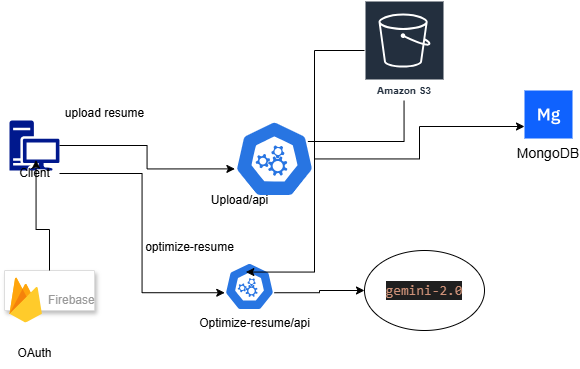

# Resume Optimization ApplicatioN
Welcome to the app for resume optimization . This application build for optimizate the resume base on user requirement source by AI Model.

## Project Overview 

### Resume Optimization Application Architecture 


## Features 
- Login page where user authenticated by google
- single page applicaton 
- state manaagement - userinfo Persisted
- You can upload resume both pdf and word file.

## Geeting Started
## Prerequisits 
- Nodejs(16+)
- NPM

## Setup Instructions
1. Clone the repository:

   ```bash
   git clone https://github.com/abishkar123/resume-optimizaton-client.git
   
   ```
2. Clone the repository:
   ```bash
   cd client
   npm install
   ```

3. Running the Application 
   ```bash
   npm run dev 
   ```
4. Run the test
   ```bash
   npm test
   ```

## Project Strcuture 

- src/: Contain the soruce code of the application.
 - compontents/:  all custom components ex-Header, private router
 - page/: contain all pages such a home and upload page
 - private-route: route the page based on authentication
 - useAuth:/ contain state management for user
 - helper:/ this folder have fetch frontend api.
 - tests:/ there three different test, for each page and api.

 ## package and dependencies
 - **dotenv**: Load environment variables from a .env file.
 - **vite:** react build on vite for handling bundling 

 ## Dev Dependencies
- nodemon: Tool that helps develop node.js based applications by automatically restarting the node application when file changes in the directory are detected
  